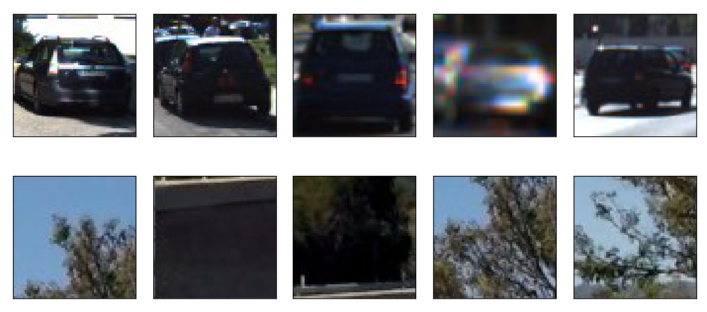
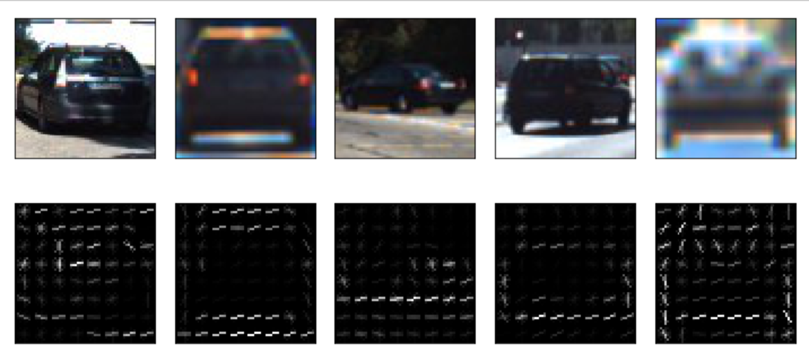
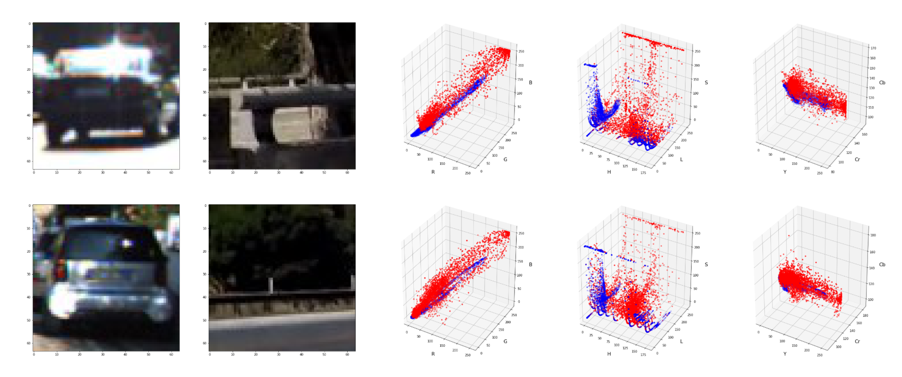
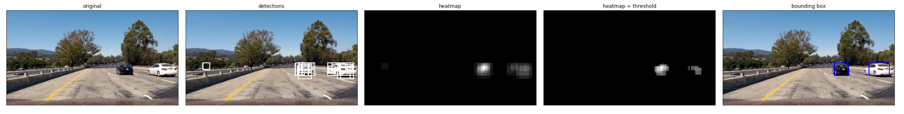
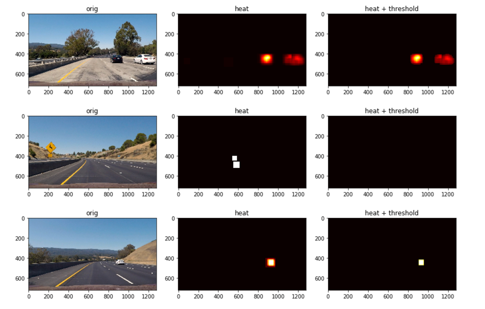
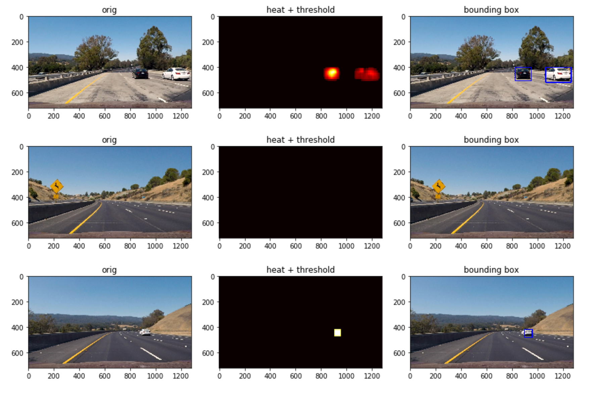

# **Vehicle Detection Project**

The goals / steps of this project are the following:

1. Perform a Histogram of Oriented Gradients (HOG) (and spatial bin and color hist) feature extraction on a labeled training set of images.
2. Train a Linear SVM classifier.
3. Implement a sliding-window search on an image and use the trained classifier to search for vehicles in images.
4. create a heat map of detections to combine multiple detections and remove false positives and estimate a bounding box.
5. Run the pipeline on a video stream frame by frame and draw bounding boxes on the image.


## [Rubric](https://review.udacity.com/#!/rubrics/513/view) Points
### Here I will consider the rubric points individually and describe how I addressed each point in my implementation.  

---
### Writeup / README

#### 0. Provide a Writeup / README that includes all the rubric points and how you addressed each one.

You're reading it!

### 1. Feature Extraction

#### 1.1. Explain how (and identify where in your code) you extracted HOG features from the training images.

The code for this step is contained in the `1.a` of the `Vehicle Detection.ipynb`  

I started by reading in all the `vehicle` and `non-vehicle` images.  A few examples of each `vehicle` and `non-vehicle` classes below:



I then explored different color spaces and different `skimage.hog()` parameters (`orientations`, `pixels_per_cell`, and `cells_per_block`).  I grabbed random images from each of the two classes and displayed them to get a feel for what the `skimage.hog()` output looks like.

Here is an example using the `Gray` color space and HOG parameters of `orientations=9`, `pixels_per_cell=(8, 8)` and `cells_per_block=(2, 2)`:




#### 1.1.b Histogram of Color (HOC)
Another feature vector I chose to add to our final vector is a histogram of color. This is to say the distribution of color throughout the image. I chose this since it is a good representation of a particular object (especially noticeably colourful objects like cars) and it is robust to changes in appearance, in that it does not rely on any structure. This can help us since we can should be able to identify cars from different angles with the same feature vector. This of course opens up some potential for false positives, if there are non-car patches with similar color distributions, but it can be used a useful vector of differentiation.

By plotting some car and non car images we can see a pattern emerge in the YCrCb color space, particularly along the Cr and Cb Axes (car pixels in red and non-car in blue).



So for our final vector we'll use an HOC in `YCrCb`.

#### 1.1. Explain how you settled on your final choice of HOG parameters.

The final choice of parameters were mostly a result of trial and error. Though the cell size of 8x8 correlates quite well with the size of particular features of a car in a 64x64 image. For example wing mirrors, tail lights, corners of rear windows etc.

#### 1.2. Describe how you trained a classifier using your selected features.

I trained a linear SVM using SciKit's `LinearSVC` and `StandardScaler`

With a Vector of all the car and not car features (vertically stacked) I normalised all the features as below: (where X is all the extracted features)

```
X_scaler = StandardScaler().fit(X)
scaled_X = X_scaler.transform(X)
```

I then used a simple train test split to fit the SVM and get an estimate of it's accuracy.

I did not use a validation set since I was using images from the test video to see directly how it was performing.

### 3. Sliding Window Search

#### 1. Describe how you implemented a sliding window search.  How did you decide what scales to search and how much to overlap windows?

The window search was implemented by scaling the original image and cutting the region of interest into equal parts in the `positive_detections` function within `VehicleDetector.py`.

I searched through varying scales that I thought would represent the minimum and maximum size we would see a car occupy in the image (relative to 64x64 px) and a couple of intermediary scales.

The smaller scale was restricted to a smaller portion of the image which is for cars further away from the camera.

![alt text][image3]

#### 2. Show some examples of test images to demonstrate how your pipeline is working. What did you do to optimize the performance of your classifier?

Ultimately I searched on four scales using YCrCb 3-channel HOG features plus spatially binned color and histograms of color in the feature vector, which provided a nice result.  Below is an illustration of the steps:



To improve reliability of classifier I used a heat map and threshold to only allow through multiple detections. The scale and overlap make this viable since adjacent windows should capture enough of the car to have multiple detections on the same vehicle.

---

### Video Implementation

#### 1. Provide a link to your final video output. 

Here's a [link to my video result](github.com/daniel1of1/carnd-vehicle-detection/output_images/project_video-annotated.mp4)


#### 2. Describe how (and identify where in your code) you implemented some kind of filter for false positives and some method for combining overlapping bounding boxes.

As mentioned previously for individual frames I produced a heat map from positive detections on a single frame. To this I applied a threshold as a way to filter out false positives. You can see this in `detect_vehicles` function in `VehicleDetector`



After this I used `SciKit`'s `label` function to create bounding boxes from the filtered multiple detections.



When it came to the video I used the same technique to combine detections over multiple frames to provide smoother bounding changes and essentially get a moving average of detections across frames. You can see this in `5 b` of the jupyter notebook.

---

### Discussion

#### 1. Briefly discuss any problems / issues you faced in your implementation of this project.  Where will your pipeline likely fail?  What could you do to make it more robust?

There is _a lot_ of room for improvement here, I'll go into a few below.

No real consideration was taken for performance other than using 'HOG subsampling' which is to say performing HOG extraction only once per frame (per scale) and using sub samples of this for each region of extraction. Extraction is currently very slow in the order of seconds per frame - obviously not viable in any kind of situation involving moving vehicles.

You will notice in the video as the white car gets further away it is no longer detected - this may indicate that we should have taken some samples at an even smaller scale.

In general the white car in the scene seems to be harder to detect for the classifier. This may be due to the color, or possibly the angle. Since it is two lanes over we see more of its side. By contrast most of the training data seems to lean a bit more heavily towards vehicles with less difference in lateral distance.

Further, with regard to the data, no consideration was taken of the fact the KITTI data set is time series based. A simple random shuffle of training and test data would not be enough to prevent a large number of similar images appearing in both training and testing sets. This likely led to overfitting of the test data.
